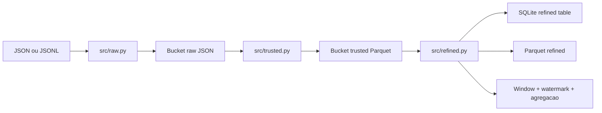

# Arquitetura

O projeto segue uma arquitetura medalhão, inspirada na organização por laboratórios do projeto de referência da disciplina `FIAP-2026-ABD-DataProductManagement`.

## Contratos

- Entrada: financiamento, cliente, veículo, segmento, região, valores e status.
- Raw: preserva os campos JSON e adiciona metadados de ingestão no bucket raw.
- Trusted: normaliza dimensões, valida domínios e grava Parquet colunar no bucket trusted.
- Refined: agrupa por janela, segmento, região, tipo, marca e modelo, calculando quantidade, total financiado, parcela média e taxa média. O resultado é gravado no Parquet e na tabela `vehicle_financing_summary` do SQLite.

## Execução

O modo local usa arquivos JSON/JSONL em `data/input/` e diretórios locais como buckets. O Compose oferece MinIO para testar object storage compatível com S3. Em produção, a fonte pode ser substituída por Kafka, os buckets podem usar S3/MinIO e o SQLite pode ser substituído por PostgreSQL quando houver necessidade de acesso concorrente e governança centralizada.
